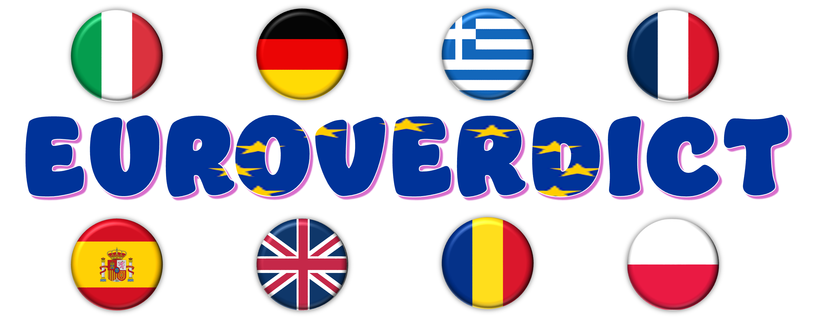
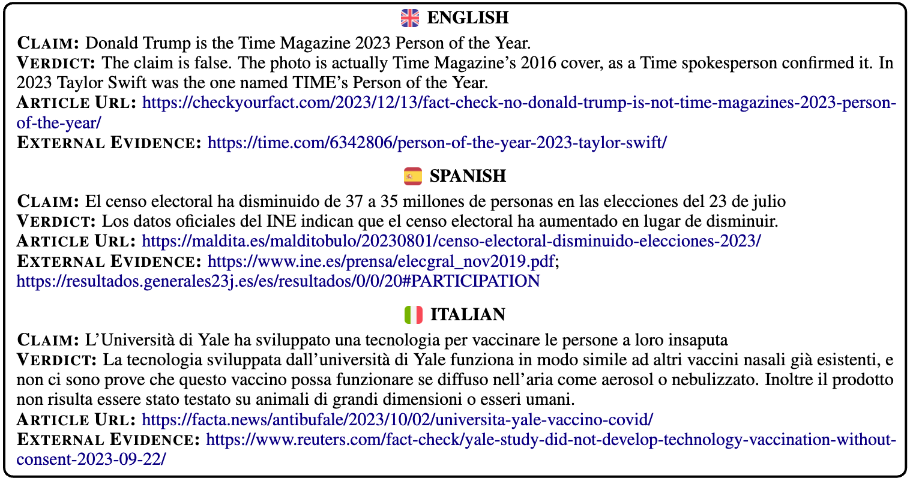
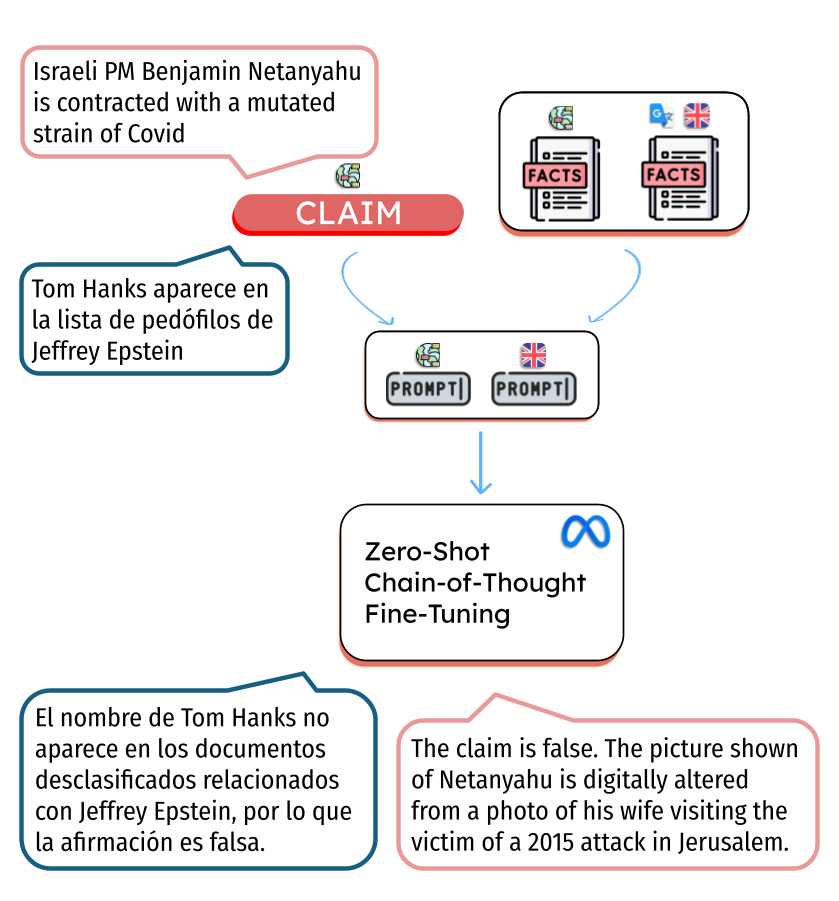
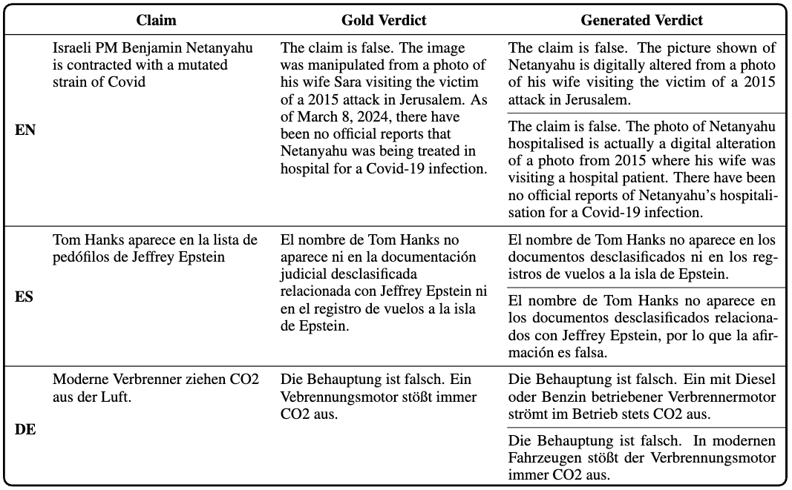

# EuroVerdict: A Multilingual Dataset for Verdict Generation Against Misinformation

<p>
  

Welcome to the EuroVerdict dataset repository! EuroVerdict is a multilingual dataset for the automatic generation of verdicts, i.e., short piece of texts that states whether and why a misleading claim is true or false. EuroVerdict was created in collaboration with professional fact-checkers from the [European Fact-Checking Standards Network](https://efcsn.com/) and covers eight European languages and a wide variety of topics.
Find more details in our ACL 2025 paper: *[EuroVerdict: A Multilingual Dataset for Verdict Generation Against Misinformation](https://aclanthology.org/2025.findings-acl.853/) (Russo et al., ACL Findings 2025)*. If you use the EuroVerdict datasets or any partial sections of it in your work, we kindly request to <a href="https://github.com/LanD-FBK/EuroVerdict/tree/main#bibtex-citation">cite</a> our original paper.

</p>

# EuroVerdict

EuroVerdict contains 1,642 entries across eight European languages: `German`, `Greek`, `English`, `Spanish`, `French`, `Italian`, `Polish`, and `Romanian`. Each entry includes the following components:

- **Claim:** A potentially misleading statement sourced from Google Fact Check Tools;
- **Verdict:** A short, expert-written explanation clarifying whether and why the claim is false, partly false, or misleading;
- **Fact-Checking Article:** the link to a journalistic document containing all the evidence needed to fact-check a claim;
- **Extra Evidence:** list of links to resources comprising relevant information supporting the verdict. 

## Dataset Creation

The data collection process involved two professional fact-checkers per language across the eight languages. In order to collect high-quality data, all fact-checkers are native speakers of their respective languages, have a minimum of two years of fact-checking experience, and are members of the European Fact-Checking Standards Network.

Fact-checkers were instructed to:

1. Select and filter claims from a list of false statements automatically collected using the Google Fact Check Tool.
2. Write a concise verdict in their native language, based on the corresponding fact-checking article.
3. Provide links to external sources that offer additional evidence supporting the verdict.

## Dataset Description

The following table presents the count of items for each subset of EuroVerdict. We report the total number of items (# Items) and the average count of external evidence (# Ext. Ev.), words, and sentences.

<table>
  <thead>
    <tr>
      <th></th>
      <th># Items</th>
      <th># Ext. Ev.</th>
      <th colspan="2">Article</th>
      <th colspan="2">Claim</th>
      <th colspan="2">Verdict</th>
    </tr>
    <tr>
      <th></th>
      <th></th>
      <th></th>
      <th>Sent.</th>
      <th>Words</th>
      <th>Sent.</th>
      <th>Words</th>
      <th>Sent.</th>
      <th>Words</th>
    </tr>
  </thead>
  <tbody>
    <tr><td><strong>EuroVerdict</strong></td><td>1642</td><td>2</td><td>41</td><td>904</td><td>1</td><td>16</td><td>2</td><td>35</td></tr>
    <tr><td><strong>German</strong></td><td>201</td><td>1</td><td>54</td><td>802</td><td>1</td><td>19</td><td>2</td><td>15</td></tr>
    <tr><td><strong>Greek</strong></td><td>195</td><td>7</td><td>50</td><td>968</td><td>1</td><td>21</td><td>2</td><td>45</td></tr>
    <tr><td><strong>English</strong></td><td>195</td><td>1</td><td>29</td><td>567</td><td>1</td><td>14</td><td>2</td><td>30</td></tr>
    <tr><td><strong>Spanish</strong></td><td>263</td><td>2</td><td>19</td><td>563</td><td>1</td><td>15</td><td>1</td><td>23</td></tr>
    <tr><td><strong>French</strong></td><td>190</td><td>1</td><td>55</td><td>1585</td><td>1</td><td>17</td><td>2</td><td>44</td></tr>
    <tr><td><strong>Italian</strong></td><td>202</td><td>1</td><td>17</td><td>428</td><td>1</td><td>16</td><td>2</td><td>41</td></tr>
    <tr><td><strong>Polish</strong></td><td>204</td><td>2</td><td>64</td><td>1112</td><td>1</td><td>10</td><td>2</td><td>32</td></tr>
    <tr><td><strong>Romanian</strong></td><td>192</td><td>1</td><td>49</td><td>1357</td><td>1</td><td>14</td><td>2</td><td>52</td></tr>
  </tbody>
</table>

In order to have an overview of the topic covered by EuroVerdict dataset, we performed topic modeling on the claims annotated by the fact-checkers during data collection. The topic modeling analysis identified several macro-topics related to misinformation and public discourse (e.g., political discussion, global conflicts, health-related misinformation). In the `./topics/` folder, we provide graphical representations of topic distributions.

## Dataset File
You can find EuroVerdict dataset in the `.data/` folder. The dataset is formatted in JSONL format. Each item comprises the following entries:
- `ID`: a unique identifier;
- `Language`: ['de' | 'el' | 'en' | 'es' | 'fr' | 'it' | 'pl' | 'ro']
- `Date` : date of publication of the fact-checking article (*yyyy-mm-dd* format);
- `Publisher` : name of the fact-checking organization that fact-checked the claim;
- `Publisher_Website` : website of the publisher;
- `Claim` : statement that needs to be fact-checked;
- `Verdict` : gold verdict written by professional fact-checkers;
- `Rating` : veracity label for the claim (as presented on Google Fact Check Tool)
- `Url` : link to the fact-checking article;
- `External_Evidence` : list of links to external knowledge sources provided by fact-checkers;
- `Set` : ['Train' | 'Test' | 'dev']

You can open it with Pandas.

```python
import pandas as pd 

EuroVerdict = pd.read_json('data/EuroVerdict_Dataset.json')
```

## EuroVerdict Examples



# Experimental Design

We tested the Llama-3.1-8B-Instruct multilingual model on EuroVerdict for the task of verdict generation, exploring various configurations. Our experimental design considered three key aspects:prompt configuration, article configuration, and training setup. The first two aspects address the multilingual setting by varying the language of the prompt and input, while the third pertains to the training setup.



## Prompts 
The file `prompts.py` contains all the LLM prompts used in our experiments. You can easily incorporate them into your own experiments by importing the file.

## Examples of Generations



# BibTex Citation

If you use EuroVerdict in your work, please cite the following paper:

```bibtex
@inproceedings{russo-etal-2025-euroverdict,
    title = "{E}uro{V}erdict: A Multilingual Dataset for Verdict Generation Against Misinformation",
    author = "Russo, Daniel  and
      Sadeghi, Fariba  and
      Menini, Stefano  and
      Guerini, Marco",
    editor = "Che, Wanxiang  and
      Nabende, Joyce  and
      Shutova, Ekaterina  and
      Pilehvar, Mohammad Taher",
    booktitle = "Findings of the Association for Computational Linguistics: ACL 2025",
    month = jul,
    year = "2025",
    address = "Vienna, Austria",
    publisher = "Association for Computational Linguistics",
    url = "https://aclanthology.org/2025.findings-acl.853/",
    pages = "16617--16634",
    ISBN = "979-8-89176-256-5"
}
```

# License
EuroVerdict can be used for research purposes and cannot be redistributed. Please cite the corresponding publication if you use it.

# Funding Acknowledgement
<p>


This work was partly supported by: the AI4TRUST project - AI-based-technologies for trustworthy solutions against disinformation (ID: 101070190), the European Union’s CERV fund under grant agreement No. 101143249 (HATEDEMICS), the European Union’s Horizon Europe research and innovation programme under grant agreement No. 101135437 (AI-CODE).
</p>

---

**For any questions or inquiries, don't hesitate to get in touch with drusso@fbk.eu**