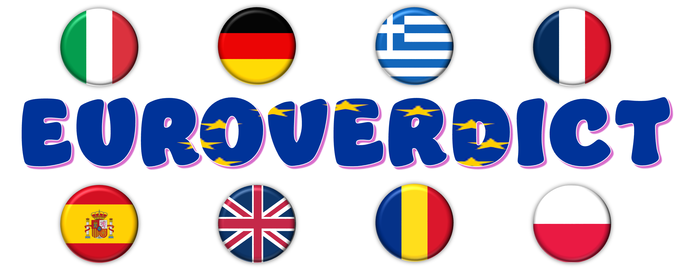

# EuroVerdict: A Multilingual Dataset for Verdict Generation Against Misinformation

  

## 🌍 Overview
EuroVerdict is a multilingual dataset developed to advance research in automated fact-checking, with a specific emphasis on generating explanatory verdicts. Created in collaboration with professional fact-checkers from the European Fact-Checking Standards Network, it responds to the pressing need for high-quality, multilingual resources to counter misinformation. The dataset reflects a broad spectrum of misinformation themes, such as health-related narratives (e.g., COVID-19 vaccines), political disinformation (e.g., election fraud allegations), geopolitical topics (e.g., Russia–Ukraine war), economic and environmental rumors.

The dataset offers carefully annotated misinformation claims, enabling systems to not only detect falsehoods but also explain them. This makes EuroVerdict especially valuable for work in multilingual NLP, explainable AI, and misinformation studies.

## 📦 Dataset Description

EuroVerdict contains 1,642 entries across eight European languages: `German`, `Greek`, `English`, `Spanish`, `French`, `Italian`, `Polish`, and `Romanian`. Each entry includes the following components:

- **Claim:** A potentially misleading statement sourced from trusted platforms like Google Fact Check Tools.
- **Verdict:** A short, expert-written explanation clarifying whether and why the claim is false, partly false, or misleading.
- **Fact-Checking Article:** The primary article used to evaluate and respond to the claim.
- **Extra Evidence:** Supplementary text-based resources that further support the verdict

Annotations were carried out by native-speaking professional fact-checkers, each with a minimum of two years of experience. Consistency and neutrality were ensured through shared annotation guidelines.

📚 Citation

If you use EuroVerdict in your work, please cite our ACL 2025 paper:

......

__`Note:`__ The dataset files will be uploaded soon. Please check back shortly or watch the repository for updates.

## 📬 Contact
For any questions or inquiries, please contact drusso@fbk.eu
